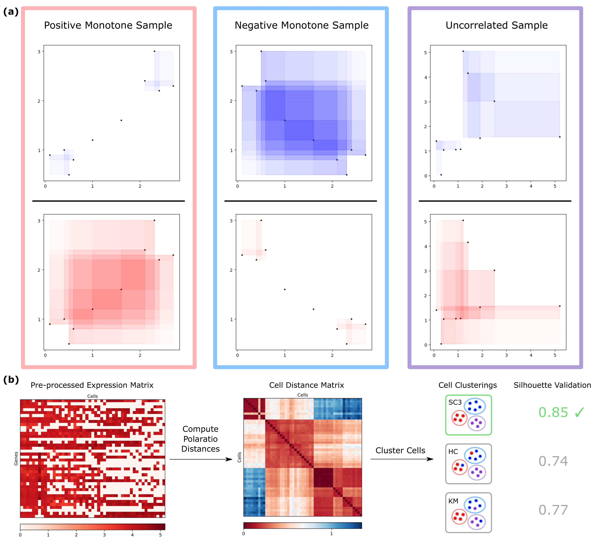

# Polaratio

Polaratio is a monotonic correlation metric that accounts for the magnitude of separation among observations.


**(a)**: The Polaratio distance between two variables is defined as the ratio of the total area between pairs of points with a negative slope to the total area between pairs of points with a positive slope. The Polaratio coefficients, from left to right, are +0.98, -0.98, and +0.31. **(b)**: To apply Polaratio to single-cell clustering, we compute the Polaratio distance between every pair of cells with respect to their gene expression values and pass the resulting distance matrix into various clustering algorithms. We then select the top performing clustering algorithm according to the greatest Silhouette index.

## Dependencies
- Python (at least 2.7)
- C++ (at least GNU 11)
- R (for scRNA-seq analysis; at least 4.0)

## How to run the code

1. Create a ```.txt``` file with a expression matrix of genes by cells. You can pre-process your expression matrix with ```preprocess.R```.

2. Compute the Polaratio cell distance matrix with the command ```python run.py <path-to-txt-file>``` (or ```python3```). The distance matrix will be output to a file named ```<stem-of-txt-file>PD.txt```. Below is the list of parameters:

| Parameter                     | Action    |
| --------------------- |:-------------:|
| ```-f``` or ```--coeff```| Output a matrix of correlation coefficients (to the file ```<stem-of-txt-file>PC.txt```) in addition to the raw distance matrix. |
| ```-c``` or ```--colnames``` | Ignore the first row of the data. |
| ```-r``` or ```--rownames``` | Ignore the first column of the data.      |
| ```-s``` or ```--single``` | Do not use multiple CPU cores. (Using this flag will decrease the total CPU time but increase the wall time.)      |

3. Modify and run the code in ```consensus.R``` to produce the cell clustering.

## Citation
If you found our work useful in your research, please consider citing the following paper:
```
@unpublished{wang2021polaratio,
author = {Wang, Victor and Cicalese, Pietro A and Louis Sam Titus, A S C and Mohan, Chandra},
title = {{Polaratio: A magnitude-contingent monotonic correlation metric and its improvements to scRNA-seq clustering}},
year = {2021},
note = {{Manuscript submitted to ISMB; pre-print available at https://doi.org/10.1101/2020.12.20.423308}}
}
```
